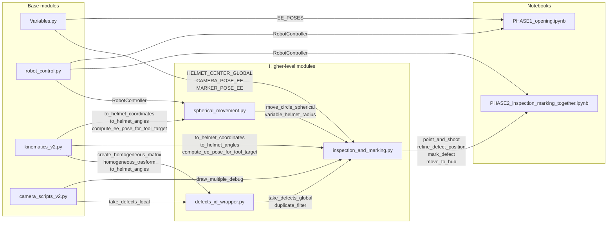

# Istruzioni per l'uso e Descrizione dei Moduli

Questo documento descrive l'architettura, le funzionalità principali e gli strumenti di test del progetto.

**Diagramma delle dipendenze (Mermaid)**


Nota: il diagramma posiziona i moduli di base a sinistra e i moduli di livello superiore a destra; le etichette sugli archi indicano le funzioni/metodi principali che generano la dipendenza.

Il repository include moduli Python dedicati a:
- controllo robotico e movimento (`robot_control.py`),
- cinematica e trasformazioni spaziali (`kinematics_v2.py`),
- elaborazione immagini e ZED camera (`camera_scripts_v2.py`),
- orchestrazione del flusso di difetto globale (`defects_id_wrapper.py`),
- movimento sferico e sicurezza limite attorno al casco (`spherical_movement.py`), con controlli `alpha`/`beta`, superficie di lavoro a raggio variabile tipo paraboloide/ellissoide e deviazioni automatiche per traiettorie non sicure,
- configurazione e pose di riferimento (`Variables.py`).

`move_circle_spherical` utilizza `variable_helmet_radius(alpha, beta)` per calcolare un raggio variabile che approssima la forma reale del casco. Il modello usa un centro virtuale leggermente più basso rispetto al vero centro del casco per raggiungere tutti i punti della cupola e produce una superficie di lavoro simile a un paraboloide/ellissoide:

- `r = r_apex - (r_apex - r_side) * sin^2(alpha)
       - (r_apex - r_back) * cos^2(beta)
       + (r_front - r_apex) * sin^2(beta-90)`

Il valore viene poi limitato da `r_min` per non scendere sotto il raggio minimo sicuro. Questo significa che il raggio è più corto sui lati e sul retro, e più lungo verso l'apice e il fronte.

Per vedere il grafico della superficie di raggio, esegui `python spherical_movement.py` dalla root del progetto; il modulo contiene un blocco `if __name__ == "__main__"` che plotta la funzione su una griglia di `alpha` e `beta`.

I notebook inclusi servono a verificare e a eseguire i flussi di lavoro in modo interattivo: ispezione, marcatura, apertura della visiera, cinematica sferica e posizionamento del casco.

**Notebooks principali**
- **Helmet positioning.ipynb**: Notebook di configurazione e calibrazione del casco. Usa pose di riferimento, frame strumentali ed end-effector per validare i parametri di posizionamento e preparare il setup robotico prima di avviare l'ispezione.
- **PHASE1_opening.ipynb**: Notebook che esegue automaticamente l'apertura e la chiusura di entrambe le visiere.
- **PHASE2_inspection_marking_together.ipynb**: Notebook finale del progetto per l'esecuzione integrata di ispezione e marcatura. Combina rilevamento difetti, coordinate globali e controllo utensile in un flusso completo per l'idenficazione, il raffinamento e la marcatura di tutti i difetti presenti sul casco.

**Notebook di test**
- **tests_inspection_marking.ipynb**: Notebook di debug e validazione del processo di ispezione e marcatura. Consente di eseguire passaggi singoli, verificare i dati dei difetti e affinare i parametri della pipeline.
- **test_spherical.ipynb**: Notebook di validazione della cinematica sferica. Controlla limiti `alpha`/`beta`, traiettorie sicure, suddivisione degli archi e le funzioni di sicurezza del modulo `spherical_movement.py`.

## 1. `robot_control.py` (Controllo Macchina)
**Scopo:** Fornisce un'astrazione Python ad alto livello per il comando sincrono e bloccante del braccio robotico Techman tramite Modbus TCP.

### Classe: `RobotController`
Questa classe incapsula le logiche di movimento e monitoraggio della posa. L'esecuzione dei comandi di moto fermerà il programma Python finché il robot non raggiunge fisicamente l'obiettivo (o fino allo scadere di un timeout).

**Costruttore ed Attributi:**
- `__init__(ip_address="127.0.0.1", default_position_j=None)`: Inizializza l'oggetto di base del TM. Configura `self.default_tolerance = 1.0` (in mm/gradi per l'errore di arrivo), `self.default_timeout = 300.0` (secondi) e accetta opzionalmente una configurazione giunti di sicurezza (salvata in `self.default_position_j`).

**Metodi di Rete e Sicurezza:**
- `connect()`: Apre la porta TCP (5890) del "Listen Node" del robot.
- `disconnect()`: Chiude la connessione di rete in modo pulito a fine operazioni.
- `emergency_stop()`: Impone un arresto istantaneo cancellando la coda dei movimenti in esecuzione (`mode=0`).
- `default_positioning()`: Sposta il robot nella posa sicura di partenza richiamando `move_joints(self.default_position_j)`. Se nessuna posa è stata passata al costruttore, la funzione non eseguirà alcun movimento.

**Metodi Privati:**
- `_wait_until_pose(target_pose, use_joints=False)`: Implementa un loop di *polling* continuo che confronta la posizione attuale (da TCP o sensori ai giunti) con il target. Se l'errore massimo tra tutti gli assi scende sotto `default_tolerance`, sblocca il programma. Solleva un'eccezione in caso di Timeout.

**Metodi di Movimento:**
- `move_ptp(pose, speed=SPEED, data_format="CPP")`: Esegue un movimento Point-to-Point cartesiano nello spazio operativo. Nota: nel codice la costante `SPEED` vale `300` ed internamente i movimenti PTP applicano uno scaling `PTP_SCALE = 0.1` (quindi il valore effettivo inviato al controller è `int(speed * 0.1)`).
- `move_joints(joints, speed=SPEED)`: Esegue un movimento puro nello spazio dei giunti. `move_joints` usa lo stesso `SPEED` con lo scaling PTP.
- `move_line(pose, speed=SPEED, data_format="CAP")`: Esegue un movimento rettilineo lineare strettamente mantenuto dal TCP (default `SPEED = 300`).
- `move_circle(mid_point, end_point, speed=300)`: Esegue un arco tridimensionale partendo dal punto attuale e passando attraverso un punto intermedio `mid_point` fino ad arrivare in `end_point`.

### Esempio d'uso (Impostazione Posizione di Default)

```python
from robot_control import RobotController
import Variables as vb

# 1. Inizializza passando la variabile contenente la posa sicura (es. LOOK_DOWN_POSITION_J_INIZIO)
controller = RobotController(ip_address="192.168.19.22", default_position_j=vb.LOOK_DOWN_POSITION_J_INIZIO)
controller.connect()

# 2. Muove immediatamente il robot nella posa specificata (se passata nel costruttore)
controller.default_positioning()
```

---

## 2. `camera_scripts_v2.py` (Visione Artificiale e Camera ZED)
**Scopo:** Interagisce con le SDK della ZED, segmenta lo spazio colore delle immagini ed estrae i dati dalla Point Cloud.

### Classe: `defect`
Contenitore dati corrispondente all'implementazione in `camera_scripts_v2.py`.

**Attributi:**
- `centroid` (numpy array): Coordinate pixel `[cx, cy]` nel frame dell'immagine 2D.
- `area` (float): Area del contorno in pixel.
- `mask` (numpy array): Maschera binaria della stessa dimensione dell'immagine (255 sulla regione del difetto, 0 altrove).
- `bgr_img` (numpy array): Immagine BGR originale usata per annotazioni.
- `points3d` (np.array | None): Punti 3D estratti dalla point-cloud corrispondenti ai pixel della maschera.
- `pos3d_camera` (np.array | None): Stima media 3D nel sistema della camera (mm).
- `pos3d_global` (np.array | None): Posizione globale (mm), valorizzata da moduli esterni quando calcolata.
- `sph_coord` (np.array | None): Coordinate sferiche `[r, alpha, beta]` (se calcolate altrove).

**Metodi implementati:**
- `img()`: Restituisce l'immagine annotata: overlay della `mask`, cerchio al `centroid` e (se presente) testo con le coordinate `pos3d_global` nell'angolo.
- `say_hi(Name=None)`: Stampa su console informazioni di debug: `centroid`, `pos3d_camera` (con Z e distanza radiale), `pos3d_global` e `sph_coord` quando disponibili.

### Funzioni Hardware ZED
- `init_zed()`: Configura l'hardware. Modalità Depth Neurale e unità in Millimetri. Inizializza i contenitori vuoti in C++ (Mat) e la SDK.
- `zed_mat_to_bgr(image_zed)`: Converte da standard RGBA interno (SDK) allo standard BGR (OpenCV) scartando il canale Alfa.

### Funzioni Analisi Immagine (OpenCV)
- `find_all_green_masks_and_centroids(bgr_image, LOWER, UPPER, MIN_AREA, attention_radius)`: Converte la foto in Spazio Colore HSV, effettua il threshold col verde, esegue operazioni morfologiche e calcola i contorni. Ritorna la lista di oggetti `defect` validi. Un `attention_radius` (opzionale) ignora punti periferici dell'ottica.
- `find_all_generic_anomaly_masks_and_centroids(bgr_image, MIN_AREA, attention_radius)`: Converte la foto in Spazio Colore HSV, costruisce una maschera dei colori attesi del casco, cioè nero, bianco, grigio e rosso classico, e successivamente ne calcola l'inverso. I pixel che non appartengono ai colori attesi vengono considerati possibili anomalie cromatiche. La funzione esegue poi filtraggio morfologico, ricerca dei contorni, validazione tramite area minima e calcolo del centroide, restituendo una lista di oggetti `defect`.
- `extract_3d_points_from_mask(mask, point_cloud)`: Filtra l'enorme mappa 3D iterando solo sulle coordinate corrispondenti ai pixel "accesi" sulla maschera. Controlla `np.isfinite` scartando nuvole corrotte.
- `compute_mean_3d_point(points_3d)`: Fa la media aritmetica (`np.mean`) sull'asse 0 per stabilizzare il rumore del sensore infrarossi e ottenere il singolo centro `[X, Y, Z]`.
- `draw_multiple_debug()`: Appiattisce tutti i difetti in una sola immagine per il monitor.
- `take_defects_local(runtime, zed, image_zed, point_cloud, attention_radius=None, generic_detection=False)`: Master Workflow. Fa uno "scatto" fisico dalla telecamera, acquisendo immagine e point cloud. Se `generic_detection=False`, chiama `find_all_green_masks_and_centroids` per cercare il difetto verde. Se `generic_detection=True`, chiama `find_all_generic_anomaly_masks_and_centroids` per cercare difetti di colore generico tramite maschera inversa dei colori attesi del casco. In entrambi i casi itera sui difetti rilevati, popola `points3d` tramite `extract_3d_points_from_mask` e assegna `pos3d_camera`. Tramite `attention_radius` permette di restringere la ricerca al solo centro dell'ottica per escludere il rumore periferico.


## 3. `kinematics_v2.py` (Motore Matematico e Cinematica)
**Scopo:** Implementa l'algebra lineare richiesta per la composizione delle matrici e le trasformazioni dello spazio Euclideo (Eye-in-Hand) e Sferico (ispezioni a cupola). Non possiede memoria o dipendenze hardware.

### Sistemi di Riferimento e Convenzioni
Il modulo gestisce la conversione continua tra diversi sistemi spaziali:
- **Globale e Angoli di Cardano (Cartesiano):** Ha origine alla base del robot Techman (SDR Assoluto). L'orientamento nello spazio è descritto dalla terna di angoli di Eulero/Cardano `[Rx, Ry, Rz]`. Il sistema adotta la convenzione di rotazione intrinseca **Z-Y-X** (equivalente all'estrinseca X-Y-Z): la rotazione totale viene calcolata applicando la matrice in ordine di asse Z, poi asse Y, infine asse X. Questo standard è matematicamente allineato a quello predefinito dal controller Techman per elaborare le pose spaziali del TCP.
- **End-Effector (TCP):** Il sistema locale solidale alla flangia terminale del braccio meccanico.
- **Utensile (Camera/Marker):** Offset cartesiano e rotazionale fisso rispetto all'End-Effector (configurazione geometrica nota come *Eye-in-Hand*).
- **Casco (Sistema Sferico):** Centrato spazialmente nell'origine `HELMET_CENTER_GLOBAL`. Piuttosto che ragionare in `[X, Y, Z]`, la navigazione sulla cupola del casco sfrutta le coordinate polari/sferiche modificate:
  - **`r` (Raggio):** Distanza in millimetri dell'obiettivo dal centro della calotta.
  - **`alpha` (Longitudine/Azimut):** Rotazione laterale attorno all'asse Y globale. Il valore `0°` definisce il meridiano di mezzeria centrale. Spostarsi a `-90°` fa navigare il robot sul lato destro del casco, mentre `+90°` descrive il lato sinistro.
  - **`beta` (Latitudine/Elevazione):** Angolo che definisce l'inclinazione dorsale sul profilo del casco. Parte dal retro orizzontale (`0°`), sale all'apice zenitale (`90°`), e discende fino all'area visiera frontale (`180°`).
  **Nota sui Gimbal Lock:** Le rotazioni nello spazio 3D soffrono intrinsecamente di singolarità matematiche ("blocchi" cardanici che fanno ribaltare i giunti del robot). Questa specifica ed innovativa convenzione sposta appositamente i poli matematici nell'estremo fronte e retro (zone inaccessibili al braccio per via della base di appoggio), assicurando che le normali traiettorie trasversali e apicali risultino sempre dolci e continue.

### Funzioni Lineari Spaziali (Cartesiane)
- `create_rot_matrix_zyx(r)`: Riceve un vettore di tre angoli di Eulero in gradi `[Rx, Ry, Rz]`, li converte in radianti e compila le 3 Matrici di Rotazione Base. Restituisce la Matrice 3x3 composta secondo ordine asse fisso `ZYX` (equivalente ad ordine intrinseco `XYZ`, coerente con Techman e trasformazioni Locale->Globale).
- `rot_matrix_to_angles_zyx(R)`: Effettua l'operazione inversa rispetto alla funzione precedente. Estrae gli angoli di Cardano dalla matrice di rotazione gestendo internamente anche le singolarità (Gimbal Lock).
- `create_homogeneous_matrix(pose, Inverse=False)`: Genera una matrice di trasformazione omogenea 4x4 `H`. Il flag `Inverse=True` permette di ottenere istantaneamente la matrice inversa $H^{-1}$ ricalcolando la trasposta $R^T$ e il vettore $-R^T t$.
  **Struttura e Funzionamento della Matrice H:**
  La matrice `H` incapsula sia l'orientamento che la posizione in un'unica struttura matematica 4x4:
  ```text
      [ R11  R12  R13 | Tx ]
  H = [ R21  R22  R23 | Ty ]
      [ R31  R32  R33 | Tz ]
      [  0    0    0  |  1 ]
  ```
  - **Sottomatrice 3x3 (Top-Left):** È la Matrice di Rotazione `R`. Le sue tre colonne rappresentano i versori degli assi X, Y e Z del sistema di riferimento *locale* proiettati rispetto al sistema *globale*.
  - **Vettore 3x1 (Top-Right):** È il vettore di Traslazione `T`. Indica le coordinate spaziali `[X, Y, Z]` dell'origine del sistema locale nello spazio globale.
  - **Riga 1x4 (Bottom):** `[0, 0, 0, 1]`. Riga fittizia (identificatore affine spaziale) necessaria unicamente per l'algebra matriciale, affinché possa moltiplicare un punto 3D.
  
  Moltiplicando `H` per un punto espresso in coordinate locali `P_L` (es. un difetto visto dalla telecamera), si ottiene la sua esatta posizione nello spazio globale `P_G` della base del robot in un solo calcolo: `P_G = H @ P_L`.
- `homogeneous_trasform(H, point)`: Moltiplica la coordinata 3D (a cui è concatenato l'identificatore affine spaziale `1.0`) per la matrice `H`. Restituisce il nuovo punto `[X, Y, Z]` ripulito dall'identificatore fittizio.

### Funzioni Superficiali/Rotazionali (Sferiche)
- `to_helmet_coordinates(spherical_coords, helmet_center)`: Traduce la tripla sferica `[r, alpha, beta]` nelle coordinate globali 3D assolute sulla calotta del casco. Calcola inoltre dinamicamente le rotazioni necessarie affinché l'asse Z dell'utensile risulti sempre perfettamente normale (incidente) alla superficie in quel punto. Restituisce un vettore posizione e un vettore rotazione.
- `compute_ee_pose_for_tool_target(p_obj, r_obj, tool_pose_ee)`: Risolutore di Cinematica Inversa spaziale. Calcola le coordinate esatte a cui portare il TCP (End-Effector) affinché il frame dell'utensile (sia esso la telecamera o il marker) coincida col punto bersaglio di ispezione. Risolve algebricamente l'equazione matriciale `H_ee_global = H_obj @ (H_tool_ee)^-1`.
- `to_helmet_angles(defect_pos, helmet_center)`: È la formulazione inversa di `to_helmet_coordinates`. Inverte la cinematica basata sul nuovo sistema a due assi per calcolare raggio `r`, `alpha` e `beta` a partire da coordinate cartesiane assolute `[X,Y,Z]`.

### Esempio d'uso (Compensazione Utensile / Cinematica Inversa)

```python
import numpy as np
import kinematics_v2 as kin
import Variables as vb

# 1. Definizione bersaglio sferico [raggio, alpha, beta]
# Es: 400mm di distanza dal centro, 45 gradi a destra, elevazione apicale
bersaglio_sferico = [400.0, 45.0, 90.0]

# 2. Calcolo posa target spaziale (orientata perpendicolarmente alla calotta)
p_obj, r_obj = kin.to_helmet_coordinates(bersaglio_sferico, vb.HELMET_CENTER_GLOBAL)

# 3. Cinematica Inversa: calcola la posa dell'End-Effector compensata per il Marker
#    (Il robot si muoverà in modo che la PUNTA del marker raggiunga p_obj)
ee_target_pose = kin.compute_ee_pose_for_tool_target(
    p_obj, r_obj, tool_pose_ee=vb.MARKER_POSE_EE
)

print("Posa TCP richiesta:", np.round(ee_target_pose, 2))
```

---

## 4. `defects_id_wrapper.py` (Orchestratore e Filtraggio)
**Scopo:** Coordina pipeline dati per lo scenario "multi-scatto", unendo dati visivi multipli nello stesso riferimento universale. Ripulisce i falsi rilevamenti e i cloni per generare la "lista finale univoca" dei punti bersaglio.

### Operazioni Matematiche
- `take_defects_global(..., generic_detection=False)`: Funzione wrapper completa che ingloba l'acquisizione (`take_defects_local`), il calcolo delle coordinate globali (`compute_global_coordinates`) e l'applicazione condizionale progressiva dei filtri spaziali (`cam_cylinder_filter` e `glob_position_filter`). Il parametro `generic_detection` viene passato a `take_defects_local`: se vale `False` viene usato il rilevamento classico del difetto verde, mentre se vale `True` viene usato il rilevamento generico tramite maschera inversa dei colori attesi del casco.
- `compute_global_coordinates(defect_list, H_cam_to_global)`: Cicla l'intera lista di difetti e sfrutta il calcolo in `kinematics_v2` applicando la matrice fornita, prelevando da `pos3d_camera` ed inserendo l'output finale in `pos3d_global` di ogni oggetto.

### Operazioni Logiche e Spaziali (Algoritmi di Filtraggio Dati)
- `cam_cylinder_filter(defect_list, radius, height_range)`: Agisce nello spazio _locale_ prima della globalizzazione. Rimuove i difetti estrapolati che risultano ai margini distorti (fuori dal cilindro di raggio X centrato sull'asse Z dell'ottica) o fuori da un range di Z (es: troppo vicini o lontani dalla focale ottima).
- `glob_position_filter(defect_list, range, center)`: Scarta tutto ciò che, pur essendo stato rilevato come difetto cromatico, si trova ad una distanza euclidea globale (`np.linalg.norm`) incompatibile col diametro del casco (es. bottiglie, vestiti sullo sfondo dell'officina).
- `duplicate_filter(defect_list, distance_threshold=10.0)`: Filtra i difetti duplicati confrontando la distanza euclidea tra gli attributi `pos3d_global`. Quando due difetti sono più vicini di `distance_threshold` mantiene quello con `area` maggiore; restituisce una nuova lista di difetti unici.

### Esempio d'uso (`take_defects_global`)

```python
import cv2
import kinematics_v2 as kin
from camera_scripts_v2 import init_zed, draw_multiple_debug
from defects_id_wrapper import take_defects_global, duplicate_filter
import Variables as vb

# 1. Inizializzazione
zed, runtime, image_zed, point_cloud = init_zed()
all_defects = []

# 2. Esecuzione di acquisizioni multiple (es. muovendo il robot in pose diverse)
pose_di_scatto = [
    [300, 500, 300, 0, 90, 0],
    [350, 500, 300, 0, 90, 0] # Posa successiva
]

for pose in pose_di_scatto:
    # Aggiornamento posizione e calcolo matrici omogenee
    H_ee_to_global = kin.create_homogeneous_matrix(pose)
    H_cam_to_ee = kin.create_homogeneous_matrix(vb.CAMERA_POSE_EE)
    H_cam_to_global = H_ee_to_global @ H_cam_to_ee

    # Acquisizione e calcolo 3D globale per la posa corrente
    defect_list, bgr_image = take_defects_global(
        runtime, zed, image_zed, point_cloud,
        H_cam_to_global=H_cam_to_global,
        cylindrical_filter=True, radius=150.0, height_range=(0, 300), generic_detection=False
    )

    # Per usare il rilevamento generico di anomalie cromatiche:
    # impostare generic_detection=True.
    # In questo caso il sistema non cerca solo il verde, ma tutto ciò che non appartiene ai colori attesi del casco.
    
    # 3. Utilizzo del plotter di debug a video
    debug_img, mask_bgr = draw_multiple_debug(bgr_image, defect_list, show_global=True)
    cv2.imshow("Debug Rilevamenti", debug_img)
    cv2.waitKey(500) # Mostra a video per mezzo secondo
    
    # Accumulo dei risultati
    all_defects.extend(defect_list)

# 4. Filtraggio finale dei duplicati sull'intera lista aggregata
unique_defects = duplicate_filter(all_defects, distance_threshold=25.0)

print(f"Rilevati {len(all_defects)} difetti totali.")
print(f"Rilevati {len(unique_defects)} difetti univoci dopo il filtraggio.")
```

---

## 5. `inspection_and_marking.py` (Funzioni ad alto livello) e `tests_inspection_marking.ipynb`
**Scopo:** `inspection_and_marking.py` fornisce le macro-funzioni (ispezione, raffinamento, marcatura) per operare sui difetti. Tali funzioni sono pensate per essere orchestrate interattivamente dal notebook `tests_inspection_marking.ipynb`, che ne gestisce il flusso logico, l'accumulo dei risultati e le conferme utente.

### Funzioni principali
- `move_to_hub(controller, hub=[0, 0, 90])`:
  - **Input:** `controller` (oggetto `RobotController`), `hub` (lista coordinate sferiche, opzionale).
  - **Output:** Nessuno (solleva eccezione se il movimento non è sicuro).
  - **Descrizione:** Sposta il robot in un punto hub sicuro sopra il casco, per separare i macro-movimenti tra i vari scatti ed evitare transizioni dirette pericolose sulla cupola.
- `point_and_shoot(controller, zed, runtime, image_zed, point_cloud, test_sph, ...)`:
  - **Input:** Sensori ZED e `controller`, `test_sph` (posizione sferica target di scatto `[r, alpha, beta]`).
  - **Output:** Tupla `(defect_list, debug_img, mask_bgr, bgr_image)` contenente la lista dei difetti (oggetti `defect`) trovati e le immagini per il debug.
  - **Descrizione:** Sposta il robot nella posizione indicata e richiama `take_defects_global` per scattare ed estrarre la posa 3D locale e globale.
- `refine_defect_position(controller, zed, runtime, image_zed, point_cloud, defect_obj, ...)`:
  - **Input:** Sensori ZED, `controller`, `defect_obj` (oggetto difetto da raffinare).
  - **Output:** Valore Booleano (`True` se raffinato con successo, `False` se nessun match valido è stato trovato o se la posa è irraggiungibile). Modifica in-place `defect_obj.pos3d_global`.
  - **Descrizione:** Per ogni difetto stimato, esegue una serie di scatti ravvicinati da una distanza fissa, associa i rilevamenti migliori e ne media le posizioni globali per massimizzare l'accuratezza (riducendo il rumore del depth sensor).
- `mark_defect(controller, defect_obj, helmet_center, ...)`:
  - **Input:** `controller`, `defect_obj` (oggetto difetto con posa 3D validata), coordinate globali del centro del casco.
  - **Output:** Valore Booleano (`True` se marcatura completata, `False` in caso di difetto non valido o traiettoria insicura).
  - **Descrizione:** Calcola la posa target del marker. Va al punto di pre-approccio, avanza linearmente sul difetto collaudato (`move_line`) e torna indietro. Salva dinamicamente la posa precedente per garantire un rientro fuori ingombro.
- `show_debug_matplotlib(debug_img, mask_bgr, title)`:
  - **Input:** Immagini in formato array `numpy` (RGB/BGR o Maschere) e una stringa `title`.
  - **Output:** Nessuno.
  - **Descrizione:** Utilità di rendering per stampare a schermo le maschere in linea sul Jupyter Notebook sfruttando `matplotlib`.

### Parametri di tuning principali
- `GENERIC_DETECTION`: abilita il rilevamento generico degli anomalie cromatiche invece della sola ricerca del verde.
- `INSPECTION_RADIUS`, `INSPECTION_POSITIONS` e `INSPECTION_SPEED`: definiscono il set di posizioni sferiche ottimali per gli scatti globali della camera.
- `CLOSE_INSPECTION_RADIUS`, `REFINE_ATTENTION_RADIUS`, `REFINE_CYLINDER_RADIUS`: restringono la ricerca spaziale durante il raffinamento al solo difetto atteso.
- `DUPLICATE_DISTANCE`, `ASSOCIATION_THRESHOLD`: distanze in millimetri utilizzate per il filtraggio e l'associazione nei frame consecutivi.

### Workflow nel Notebook
1. **Inizializzazione**: connessione ai sensori ZED e al controller robot, riposizionamento in `LOOK_DOWN`.
2. **Ispezione Globale**: iterazione su `INSPECTION_POSITIONS` mediante `point_and_shoot` con pause e scatti comandati a step, accumulando e filtrando i cloni.
3. **Raffinamento**: per ogni difetto univoco viene richiamato `refine_defect_position` con N scatti ravvicinati per ricalcolare `pos3d_global`.
4. **Marcatura**: interazione di controllo per marcare fisicamente tutti o alcuni dei difetti confermati richiamando `mark_defect`.

---

## 6. `spherical_movement.py` (Movimento Sferico e Sicurezza)
**Scopo:** Gestisce il movimento del robot attorno alla calotta sferica del casco in totale sicurezza, eludendo zone di collisione (es. la base d'appoggio o ingombri frontali/posteriori) ed evitando ostacoli e singolarità.

### Funzioni di Sicurezza e Controllo Traiettoria
- `angles_unsafe(alpha, beta)`: Verifica se una singola coordinata sferica di destinazione viola i limiti geometrici (es. `alpha` fuori da +/- 90 gradi, o `beta` in zone di collisione anteriori/posteriori calcolate dinamicamente).
- `is_trajectory_unsafe(start_alpha, start_beta, end_alpha, end_beta)`: Valuta la sicurezza di un intero arco di traiettoria discretizzandolo in step intermedi. Rileva se il percorso sferico diretto tra due punti sicuri attraversa inavvertitamente una zona di collisione.
- `move_circle_spherical(controller, end_sph_coord, radius, tool_pose_ee, helmet_center, speed)`: Funzione master di movimento. Prende in carico lo spostamento calcolando e validando dinamicamente la traiettoria migliore:
  - **Verifica Validità:** Controlla la sicurezza della destinazione finale scartando pose pericolose.
  - **Ottimizzazione Movimento Corto:** Esegue un movimento ottimizzato `move_ptp` per distanze angolari molto brevi (< 5°).
  - **Calcolo Archi:** Esegue movimenti `move_circle` fluidi ricavando automaticamente e coerentemente il punto intermedio (midpoint).
  - **Suddivisione Archi Ampi:** Intercetta e suddivide automaticamente i movimenti sferici troppo ampi (es. > 90°) spezzandoli in due movimenti sequenziali, per prevenire deviazioni indesiderate del controller fisico.
  - **Deviazione di Sicurezza:** Se la traiettoria più breve risulta pericolosa (es. attraversa l'ingombro del viso o la base del casco), devia in autonomia il percorso forzando un transito sicuro attraverso l'apice del casco (`alpha=0`, `beta=90`).

### Esempio d'uso (Movimento verso un nuovo target)

```python
import numpy as np
from spherical_movement import move_circle_spherical
from robot_control import RobotController
import Variables as vb

# 1. Connessione al robot
controller = RobotController(ip_address="192.168.19.22")
controller.connect()

# 2. Definizione del target sferico [Raggio, Alpha, Beta]
target_spherical = np.array([400, 45, 90]) # Raggio 400mm, 45 gradi a destra, elevazione apicale

# 3. Comando di movimento sicuro
success = move_circle_spherical(
    controller=controller,
    end_sph_coord=target_spherical,
    radius=400,
    tool_pose_ee=vb.CAMERA_POSE_EE,
    helmet_center=vb.HELMET_CENTER_GLOBAL,
    speed=300
)

if success:
    print("Movimento completato in sicurezza.")
else:
    print("Destinazione fuori dai limiti di sicurezza. Movimento annullato.")
```