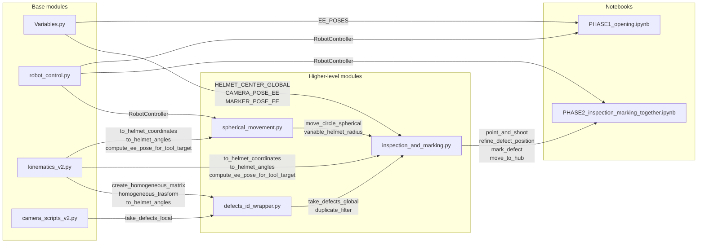

# User Manual and Module Description

This document describes the architecture, main functionalities, and testing tools of the project.

**Dependency Diagram (Mermaid)**



Note: The diagram positions the base modules on the left and the higher-level modules on the right; the labels on the edges indicate the **main** functions/methods that generate the dependency.

The repository includes Python modules dedicated to:

* Robotic control and motion (`robot_control.py`),
* Kinematics and spatial transformations (`kinematics_v2.py`),
* Image processing and ZED camera management (`camera_scripts_v2.py`),
* Global defect workflow orchestration (`defects_id_wrapper.py`),
* Spherical movement and safety boundary control around the helmet (`spherical_movement.py`), featuring `alpha`/`beta` constraints, a variable radius working surface (paraboloid/ellipsoid type), and automatic deviations for unsafe trajectories,
* Configuration and reference poses (`Variables.py`).

`move_circle_spherical` utilizes `variable_helmet_radius(alpha, beta)` to compute a variable radius that approximates the actual shape of the helmet. The model uses a virtual center slightly lower than the true helmet center to reach all points of the dome, producing a working surface similar to a paraboloid/ellipsoid:

* `r = r_apex - (r_apex - r_side) * sin^2(alpha) - (r_apex - r_back) * cos^2(beta) + (r_front - r_apex) * sin^2(beta-90)`

The resulting value is then bounded by `r_min` to prevent falling below the minimum safe radius. This implies that the radius is shorter on the sides and back, and longer towards the apex and front.

To visualize the radius surface plot, execute `python spherical_movement.py` from the project root; the module contains an `if __name__ == "__main__"` block that plots the function over a grid of `alpha` and `beta` angles.

The included notebooks serve to verify and execute the workflows interactively: inspection, marking, visor opening, spherical kinematics, and helmet positioning.

**Main Notebooks**

* **Helmet positioning.ipynb**: Configuration and calibration notebook for the helmet. It utilizes reference poses, tool frames, and end-effector data to validate positioning parameters and prepare the robotic setup prior to initiating the inspection.
* **PHASE1_opening.ipynb**: Notebook that automatically executes the opening and closing sequences for both visors.
* **PHASE2_inspection_marking_together.ipynb**: Final project notebook for the integrated execution of inspection and marking. It combines defect detection, global coordinates computation, and tool control within a comprehensive pipeline for the identification, refinement, and marking of all defects present on the helmet.

**Testing Notebooks**

* **tests_inspection_marking.ipynb**: Debugging and validation notebook for the inspection and marking process. It allows executing single steps, verifying defect data, and fine-tuning pipeline parameters.
* **test_spherical.ipynb**: Validation notebook for spherical kinematics. It verifies `alpha`/`beta` limits, safe trajectories, arc segmentation, and the safety functions of the `spherical_movement.py` module.

---

## 1. `robot_control.py` (Machine Control)

**Purpose:** Provides a high-level Python abstraction for the synchronous, blocking command of the Techman robotic arm via Modbus TCP.

### Class: `RobotController`

This class encapsulates motion logic and pose monitoring. The execution of motion commands blocks the Python program execution until the robot physically reaches the target (or a timeout expires).

**Constructor and Attributes:**

* `__init__(ip_address="127.0.0.1", default_position_j=None)`: Initializes the core TM object. Configures `self.default_tolerance = 1.0` (in mm/degrees for arrival error) and `self.default_timeout = 300.0` (seconds). It optionally accepts a safe joint configuration (saved in `self.default_position_j`).

**Network and Safety Methods:**

* `connect()`: Opens the TCP port (5890) of the robot's "Listen Node".
* `disconnect()`: Closes the network connection gracefully upon terminating operations.
* `emergency_stop()`: Enforces an instantaneous stop by clearing the active motion queue (`mode=0`).
* `default_positioning()`: Moves the robot to the initial safe pose by invoking `move_joints(self.default_position_j)`. If no pose was passed to the constructor, the function executes no motion.

**Private Methods:**

* `_wait_until_pose(target_pose, use_joints=False)`: Implements a continuous polling loop that compares the current pose (retrieved via TCP or joint sensors) with the target. If the maximum error across all axes drops below `default_tolerance`, the program unblocks. Raises an exception in case of a timeout.

**Motion Methods:**

* `move_ptp(pose, speed=SPEED, data_format="CPP")`: Executes a Cartesian Point-to-Point motion in the operational space. Note: within the codebase, the `SPEED` constant is set to `300`, and internally PTP movements apply a scaling factor `PTP_SCALE = 0.1` (hence, the actual value transmitted to the controller is `int(speed * 0.1)`).
* `move_joints(joints, speed=SPEED)`: Executes a pure motion in the joint space. `move_joints` utilizes the same `SPEED` constant with PTP scaling.
* `move_line(pose, speed=SPEED, data_format="CAP")`: Executes a straight linear motion strictly maintained by the TCP (default `SPEED = 300`).
* `move_circle(mid_point, end_point, speed=300)`: Executes a three-dimensional arc starting from the current point, passing through an intermediate point `mid_point`, and terminating at `end_point`.

---

## 2. `camera_scripts_v2.py` (Computer Vision and ZED Camera)

**Purpose:** Interacts with the ZED SDK, segments image color spaces, and extracts data from the Point Cloud.

### Class: `defect`

Data container corresponding to the implementation within `camera_scripts_v2.py`.

**Attributes:**

* `centroid` (numpy array): 2D pixel coordinates `[cx, cy]` within the image frame.
* `area` (float): Contour area measured in pixels.
* `mask` (numpy array): Binary mask matching the image dimensions (255 on the defect region, 0 elsewhere).
* `bgr_img` (numpy array): Original BGR image used for annotations.
* `points3d` (np.array | None): 3D points extracted from the point cloud corresponding to active mask pixels.
* `pos3d_camera` (np.array | None): Average 3D estimation within the camera coordinate system (mm).
* `pos3d_global` (np.array | None): Global position (mm), populated by external modules once computed.
* `sph_coord` (np.array | None): Spherical coordinates `[r, alpha, beta]` (if computed externally).

**Implemented Methods:**

* `img()`: Returns the annotated image featuring a mask overlay, a circle centered at the `centroid`, and text indicating `pos3d_global` coordinates in the corner (if available).
* `say_hi(Name=None)`: Outputs debugging information to the console: `centroid`, `pos3d_camera` (including Z depth and radial distance), `pos3d_global`, and `sph_coord` when available.

### ZED Hardware Functions

* `init_zed()`: Configures the hardware. Sets Neural Depth mode and units to Millimeters. Initializes empty C++ containers (Mat) and the SDK.
* `zed_mat_to_bgr(image_zed)`: Converts the internal RGBA standard (SDK) to the BGR standard (OpenCV), discarding the Alpha channel.

### Image Analysis Functions (OpenCV)

* `find_all_green_masks_and_centroids(bgr_image, LOWER, UPPER, MIN_AREA, attention_radius)`: Converts the image to the HSV color space, performs thresholding for green color, applies morphological operations, and computes contours. Returns a list of valid `defect` objects. An optional `attention_radius` filters out peripheral lens noise.
* `find_all_generic_anomaly_masks_and_centroids(bgr_image, MIN_AREA, attention_radius)`: Converts the image to the HSV color space, constructs a mask of the expected helmet colors (black, white, gray, and classic red), and subsequently inverts it. Pixels not belonging to the expected colors are classified as potential chromatic anomalies. The function then executes morphological filtering, contour retrieval, minimum area validation, and centroid computation, returning a list of `defect` objects.
* `extract_3d_points_from_mask(mask, point_cloud)`: Filters the comprehensive 3D map by iterating exclusively over coordinates corresponding to "active" pixels within the mask. Discards corrupted cloud points using `np.isfinite`.
* `compute_mean_3d_point(points_3d)`: Computes the arithmetic mean (`np.mean`) along axis 0 to mitigate infrared sensor noise and extract a single centroid `[X, Y, Z]`.
* `draw_multiple_debug()`: Flattens all detected defects onto a single monitor display image.
* `take_defects_local(runtime, zed, image_zed, point_cloud, attention_radius=None, generic_detection=False)`: Master Workflow. Captures a physical frame from the camera, acquiring both the image and the point cloud. If `generic_detection=False`, it invokes `find_all_green_masks_and_centroids` to isolate green defects. If `generic_detection=True`, it invokes `find_all_generic_anomaly_masks_and_centroids` to detect generic color anomalies via the inverse expected color mask. In both scenarios, it loops over detected defects, populates `points3d` via `extract_3d_points_from_mask`, and assigns `pos3d_camera`. The `attention_radius` allows bounding the search to the lens center to exclude peripheral noise.

---

## 3. `kinematics_v2.py` (Mathematical Engine and Kinematics)

**Purpose:** Implements the linear algebra required for matrix composition and coordinate transformations within Euclidean space (Eye-in-Hand) and Spherical space (dome-based inspections). It operates statelessly without hardware dependencies.

### Reference Systems and Conventions

The module manages continuous transformations across distinct spatial systems:

* **Global and Cardan Angles (Cartesiano):** Originates at the base of the Techman robot (Absolute Reference Frame). Spatial orientation is described by a triad of Euler/Cardan angles `[Rx, Ry, Rz]`. The system adopts a **Z-Y-X** intrinsic rotation convention (equivalent to X-Y-Z extrinsic): the total rotation is computed by sequentially applying the matrix along the Z axis, then the Y axis, and finally the X axis. This standard is mathematically aligned with the default configuration used by the Techman controller to compute spatial TCP poses.
* **End-Effector (TCP):** The local reference system attached to the terminal flange of the mechanical arm.
* **Tool (Camera/Marker):** Fixed Cartesian and rotational offset relative to the End-Effector (a geometric configuration known as *Eye-in-Hand*).
* **Helmet (Spherical System):** Spatially centered at the origin defined by `HELMET_CENTER_GLOBAL`. Rather than processing positions in `[X, Y, Z]`, navigation over the helmet dome leverages modified polar/spherical coordinates:
* **`r` (Radius):** Distance in millimeters from the target to the center of the shell.
* **`alpha` (Longitude/Azimuth):** Lateral rotation around the global Y axis. A value of `0°` defines the central midline meridian. Moving to `-90°` directs the robot to the right side of the helmet, while `+90°` describes the left side.
* **`beta` (Latitude/Elevation):** Angle defining the dorsal inclination along the helmet profile. It originates from the horizontal rear (`0°`), ascends to the zenith apex (`90°`), and descends to the front visor region (`180°`).
**Note on Gimbal Lock:** 3D spatial rotations inherently suffer from mathematical singularities (gimbal locks that cause robot joint flips). This specific convention intentionally shifts the mathematical poles to the extreme front and rear regions (areas inaccessible to the arm due to the physical mounting base), ensuring that nominal transverse and apical trajectories remain smooth and continuous.


### Spatial Linear Functions (Cartesian)

* `create_rot_matrix_zyx(r)`: Receives a vector of three Euler angles in degrees `[Rx, Ry, Rz]`, converts them to radians, and compiles the 3 Base Rotation Matrices. Returns the composed 3x3 Rotation Matrix according to the `ZYX` fixed-axis order (equivalent to the `XYZ` intrinsic order, consistent with Techman and Local->Global transformations).
* `rot_matrix_to_angles_zyx(R)`: Performs the inverse operation of the aforementioned function. Extracts Cardan angles from the rotation matrix while internally managing singularities (Gimbal Lock).
* `create_homogeneous_matrix(pose, Inverse=False)`: Generates a 4x4 homogeneous transformation matrix `H`. Setting the flag `Inverse=True` computes the inverse matrix $H^{-1}$ by calculating the transpose $R^T$ and the vector $-R^T t$.
**Structure and Operation of Matrix H:**
The matrix `H` encapsulates both orientation and position within a single 4x4 mathematical structure:
```text
    [ R11  R12  R13 | Tx ]
H = [ R21  R22  R23 | Ty ]
    [ R31  R32  R33 | Tz ]
    [  0    0    0  |  1 ]

```


* **3x3 Submatrix (Top-Left):** Represents the Rotation Matrix `R`. Its three columns correspond to the unit vectors of the X, Y, and Z axes of the *local* reference system projected onto the *global* space.
* **3x1 Vector (Top-Right):** Represents the Translation Vector `T`. It indicates the `[X, Y, Z]` spatial coordinates of the local origin within the global space.
* **1x4 Row (Bottom):** `[0, 0, 0, 1]`. A dummy row (spatial affine identifier) required strictly for matrix algebra execution when multiplying a 3D point.


Multiplying `H` by a point expressed in local coordinates `P_L` (e.g., a defect detected by the camera) yields its exact position within the global space `P_G` of the robot base in a single operation: `P_G = H @ P_L`.
* `homogeneous_trasform(H, point)`: Multiplies the 3D coordinate (concatenated with the spatial affine identifier `1.0`) by the matrix `H`. Returns the transformed `[X, Y, Z]` point stripped of the dummy identifier.

### Surface/Rotational Functions (Spherical)

* `to_helmet_coordinates(spherical_coords, helmet_center)`: Translates the spherical triad `[r, alpha, beta]` into absolute 3D global coordinates on the helmet shell. It dynamically computes the rotations required to maintain the tool's Z-axis perfectly normal (perpendicular) to the surface at that point. Returns a position vector and a rotation vector.
* `compute_ee_pose_for_tool_target(p_obj, r_obj, tool_pose_ee)`: Spatial Inverse Kinematics solver. Computes the exact coordinates for the End-Effector (TCP) such that the tool frame (either camera or marker) aligns with the target inspection point. Algebraically solves the matrix equation `H_ee_global = H_obj @ (H_tool_ee)^-1`.
* `to_helmet_angles(defect_pos, helmet_center)`: Inverse formulation of `to_helmet_coordinates`. Inverts the kinematics based on the dual-axis system to compute the radius `r`, `alpha`, and `beta` from absolute Cartesian coordinates `[X, Y, Z]`.

---

## 4. `defects_id_wrapper.py` (Orchestration and Filtering)

**Purpose:** Coordinates the data pipeline for the "multi-shot" scenario, merging multiple visual inputs into a unified universal reference frame. It filters out false positives and clones to generate the definitive unique list of target points.

### Mathematical Operations

* `take_defects_global(..., generic_detection=False)`: Comprehensive wrapper function encapsulating frame acquisition (`take_defects_local`), global coordinate computation (`compute_global_coordinates`), and the progressive conditional application of spatial filters (`cam_cylinder_filter` and `glob_position_filter`). The `generic_detection` parameter is passed to `take_defects_local`: if set to `False`, conventional green defect detection is used; if set to `True`, generic detection via the inverse expected helmet color mask is executed instead.
* `compute_global_coordinates(defect_list, H_cam_to_global)`: Iterates through the entire defect list and leverages `kinematics_v2` computations to apply the provided matrix, retrieving data from `pos3d_camera` and assigning the output to the `pos3d_global` attribute of each object.

### Logical and Spatial Operations (Data Filtering Algorithms)

* `cam_cylinder_filter(defect_list, radius, height_range)`: Operates within the *local* space prior to global coordinate conversion. Removes extrapolated defects located near distorted margins (outside a cylinder of radius X centered on the optical Z axis) or outside a defined Z range (e.g., too close or too far from the optimal focal distance).
* `glob_position_filter(defect_list, range, center)`: Discards objects that, despite being flagged as color defects, present a global Euclidean distance (`np.linalg.norm`) incompatible with the helmet's physical diameter (e.g., background items like bottles or clothing in the workshop).
* `duplicate_filter(defect_list, distance_threshold=10.0)`: Filters duplicate defects by comparing the Euclidean distance between their `pos3d_global` attributes. When two defects are located closer than the `distance_threshold`, the item with the larger `area` is retained; it returns a new list of unique defects.

---

## 5. `spherical_movement.py` (Spherical Motion and Safety)

**Purpose:** Manages robot motion around the spherical helmet shell safely, bypassing collision zones (e.g., the mounting base or structural front/rear obstructions) and avoiding obstacles or kinematic singularities. It also implements a variable radius working surface computation to conform to the actual helmet geometry.

### Working Surface Modeling

* `variable_helmet_radius(alpha, beta, ...)`: Computes the optimal working radius based on current spherical coordinates. Since the shell is not a perfect sphere, this function defines a smooth quadratic surface that increases TCP distance at the apex (e.g., 400 mm) and decreases it on the sides and rear (e.g., 300 mm). The baseline mathematical model is defined as:
`r(alpha, beta) = r_apex - (r_apex - r_side) * sin^2(alpha) - (r_apex - r_back) * cos^2(beta) + (r_front - r_apex) * sin^2(beta-90)`
The result is evaluated and bounded from below by the `r_min` parameter to prevent physical interferences between the tool and the workpiece.
* `make_radius_fn(radius)`: Normalization function that accepts either a constant scalar radius or an angle-dependent function (such as `variable_helmet_radius`). This abstraction ensures backward compatibility of the module with legacy workflows.

### Safety Functions and Trajectory Control

* `angles_unsafe(alpha, beta)`: Verifies whether a target spherical coordinate violates spatial geometric limits (e.g., alpha outside the [-89°, 89°] interval, or beta inside dynamically computed front/rear collision volumes).
* `is_trajectory_unsafe(start_alpha, start_beta, end_alpha, end_beta)`: Evaluates the safety of an entire trajectory arc by discretizing it into a finite number of intermediate interpolations. Detects if the direct spherical path between two safe endpoints crosses an unsafe collision zone.
* `move_circle_spherical(controller, end_sph_coord, radius, tool_pose_ee, helmet_center, speed)`: Main method for executing operational motion. It manages displacement while dynamically validating the trajectory:
* **Dynamic Radius Computation:** If the provided `radius` parameter is functional (e.g., `variable_helmet_radius`), the radius is recomputed for each nodal point of the trajectory (including the intermediate midpoint) to accurately map the calculated ellipsoidal surface.
* **Validity Verification:** Validates the final destination safety, discarding unreachable poses.
* **Short Motion Optimization:** Executes an optimized straight-line motion in the operational space (`move_ptp`) for angular distances below 5°.
* **Arc Computation:** Executes continuous curvilinear motions (`move_circle`) by analytically determining the intermediate pass-through point.
* **Wide Arc Segmentation:** Automatically intercepts and segments spherical movements exceeding 90° into two sequential segments to prevent controller kinematic singularities.
* **Safety Deviation:** If the direct trajectory intersects restricted clearance volumes, it autonomously re-routes the path by introducing a safe transit node at the system's zenith apex (alpha=0°, beta=90°).


---

## 6. `inspection_and_marking.py` (High-Level Functions) and `tests_inspection_marking.ipynb`

**Purpose:** `inspection_and_marking.py` provides macro-functions (inspection, refinement, marking) to manipulate defects. These functions are designed to be orchestrated interactively via the `tests_inspection_marking.ipynb` notebook, which manages the logical flow, result aggregation, and user confirmations.

### Main Functions

* `move_to_hub(controller, hub=[0, 0, 90])`:
* **Input:** `controller` (`RobotController` object), `hub` (optional list of spherical coordinates).
* **Output:** None (raises an exception if the movement is unsafe).
* **Description:** Moves the robot to a designated safe hub point above the helmet, separating macro-movements between distinct captures to avoid dangerous direct transitions across the dome.


* `point_and_shoot(controller, zed, runtime, image_zed, point_cloud, test_sph, ...)`:
* **Input:** ZED sensors, `controller`, and `test_sph` (target spherical capture position `[r, alpha, beta]`).
* **Output:** A tuple `(defect_list, debug_img, mask_bgr, bgr_image)` containing the list of isolated defects (`defect` objects) and debug images.
* **Description:** Displaces the robot to the specified pose and invokes `take_defects_global` to capture data and extract local and global 3D coordinates.


* `refine_defect_position(controller, zed, runtime, image_zed, point_cloud, defect_obj, ...)`:
* **Input:** ZED sensors, `controller`, and `defect_obj` (target defect object to refine).
* **Output:** Boolean value (`True` if successfully refined, `False` if no valid match is found or if the pose is unreachable). Modifies `defect_obj.pos3d_global` in-place.
* **Description:** For each estimated defect, executes a sequence of close-up captures from a fixed distance, associates the best detections, and averages their global positions to maximize accuracy (minimizing depth sensor noise).


* `mark_defect(controller, defect_obj, helmet_center, ...)`:
* **Input:** `controller`, `defect_obj` (validated defect object), and global helmet center coordinates.
* **Output:** Boolean value (`True` if marking completed, `False` in case of an invalid defect or unsafe trajectory).
* **Description:** Computes the marker target pose. Moves to the pre-approach point, advances linearly onto the validated defect (`move_line`), and retracts. Dynamically stores the previous pose to guarantee a safe exit trajectory outside clearance boundaries.


* `show_debug_matplotlib(debug_img, mask_bgr, title)`:
* **Input:** Images formatted as `numpy` arrays (RGB/BGR or Masks) and a `title` string.
* **Output:** None.
* **Description:** Rendering utility to output inline masks within the Jupyter Notebook using `matplotlib`.


### Main Tuning Parameters

* `GENERIC_DETECTION`: Enables generic chromatic anomaly detection instead of restricting the search exclusively to green targets.
* `INSPECTION_RADIUS`, `INSPECTION_POSITIONS`, and `INSPECTION_SPEED`: Define the optimal set of spherical positions for global camera captures.
* `CLOSE_INSPECTION_RADIUS`, `REFINE_ATTENTION_RADIUS`, and `REFINE_CYLINDER_RADIUS`: Restrict the spatial search domain to the expected defect location during the refinement phase.
* `DUPLICATE_DISTANCE` and `ASSOCIATION_THRESHOLD`: Distances in millimeters utilized for spatial filtering and frame-to-frame association across consecutive steps.

### Notebook Workflow

1. **Initialization**: Connects to the ZED sensors and the robot controller, then resets the arm to the `LOOK_DOWN` configuration.
2. **Global Inspection**: Iterates through `INSPECTION_POSITIONS` using `point_and_shoot` with scheduled pauses and triggered captures, aggregating data and filtering out clones.
3. **Refinement**: Invokes `refine_defect_position` for each unique defect, performing $N$ close-up captures to recompute an accurate `pos3d_global`.
4. **Marking**: Interactive step allowing users to physically mark all or selected confirmed defects by executing `mark_defect`.

---

```markdown
### 1. Code Snippet for `robot_control.py` (Default Positioning Example)
```python
from robot_control import RobotController
import Variables as vb

# 1. Initialize by passing the variable containing the safe pose (e.g., LOOK_DOWN_POSITION_J_INIZIO)
controller = RobotController(ip_address="192.168.19.22", default_position_j=vb.LOOK_DOWN_POSITION_J_INIZIO)
controller.connect()

# 2. Immediately move the robot to the specified default pose (if passed in the constructor)
controller.default_positioning()

```

### 2. Code Snippet for `kinematics_v2.py` (Tool Compensation / Inverse Kinematics Example)

```python
import numpy as np
import kinematics_v2 as kin
import Variables as vb

# 1. Define spherical target [radius, alpha, beta]
# Example: 400mm distance from center, 45 degrees right, apical elevation
spherical_target = [400.0, 45.0, 90.0]

# 2. Compute spatial target pose (oriented perpendicularly to the shell)
p_obj, r_obj = kin.to_helmet_coordinates(spherical_target, vb.HELMET_CENTER_GLOBAL)

# 3. Inverse Kinematics: compute the End-Effector pose compensated for the Marker tool
#    (The robot moves so that the TIP of the marker reaches p_obj)
ee_target_pose = kin.compute_ee_pose_for_tool_target(
    p_obj, r_obj, tool_pose_ee=vb.MARKER_POSE_EE
)

print("Required TCP Pose:", np.round(ee_target_pose, 2))

```

### 3. Code Snippet for `defects_id_wrapper.py` (`take_defects_global` Example)

```python
import cv2
import kinematics_v2 as kin
from camera_scripts_v2 import init_zed, draw_multiple_debug
from defects_id_wrapper import take_defects_global, duplicate_filter
import Variables as vb

# 1. Initialization
zed, runtime, image_zed, point_cloud = init_zed()
all_defects = []

# 2. Execute multiple acquisitions (e.g., by moving the robot to different poses)
capture_poses = [
    [300, 500, 300, 0, 90, 0],
    [350, 500, 300, 0, 90, 0] # Subsequent pose
]

for pose in capture_poses:
    # Update position and compute homogeneous matrices
    H_ee_to_global = kin.create_homogeneous_matrix(pose)
    H_cam_to_ee = kin.create_homogeneous_matrix(vb.CAMERA_POSE_EE)
    H_cam_to_global = H_ee_to_global @ H_cam_to_ee

    # Capture and compute global 3D coordinates for the current pose
    defect_list, bgr_image = take_defects_global(
        runtime, zed, image_zed, point_cloud,
        H_cam_to_global=H_cam_to_global,
        cylindrical_filter=True, radius=150.0, height_range=(0, 300), generic_detection=False
    )

    # Note: To use generic chromatic anomaly detection, set generic_detection=True.
    # In this case, the system isolates any feature that deviates from the expected helmet colors.
    
    # 3. Utilize the on-screen debug plotter
    debug_img, mask_bgr = draw_multiple_debug(bgr_image, defect_list, show_global=True)
    cv2.imshow("Detection Debug", debug_img)
    cv2.waitKey(500) # Display frame for 500ms
    
    # Accumulate results
    all_defects.extend(defect_list)

# 4. Final duplicate filtering over the entire aggregated list
unique_defects = duplicate_filter(all_defects, distance_threshold=25.0)

print(f"Total defects detected: {len(all_defects)}")
print(f"Unique defects isolated after filtering: {len(unique_defects)}")

```

### 4. Code Snippet for `spherical_movement.py` (Motion with Variable Radius Example)

```python
import numpy as np
from spherical_movement import move_circle_spherical, variable_helmet_radius
from robot_control import RobotController
import Variables as vb

# 1. Initialize robot connection
controller = RobotController(ip_address="192.168.19.22")
controller.connect()

# 2. Define spherical target [Dummy Radius, Alpha, Beta]
# The radius component in the array will be overwritten by the dynamic function.
target_spherical = np.array([0, 45, 90]) 

# 3. Command a safe motion interpolating the variable radius function
success = move_circle_spherical(
    controller=controller,
    end_sph_coord=target_spherical,
    radius=variable_helmet_radius, # Passing the mathematical function reference
    tool_pose_ee=vb.CAMERA_POSE_EE,
    helmet_center=vb.HELMET_CENTER_GLOBAL,
    speed=300
)

if success:
    print("Motion safely completed along the ellipsoidal surface.")
else:
    print("Destination violates safety constraints. Motion aborted.")

```

```

```