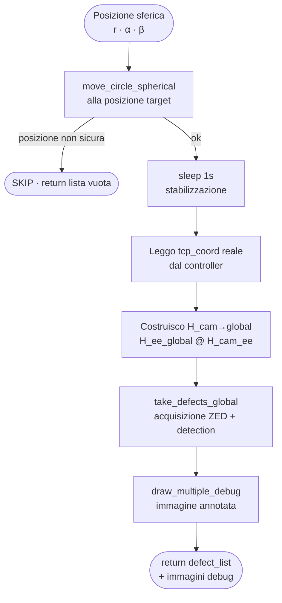
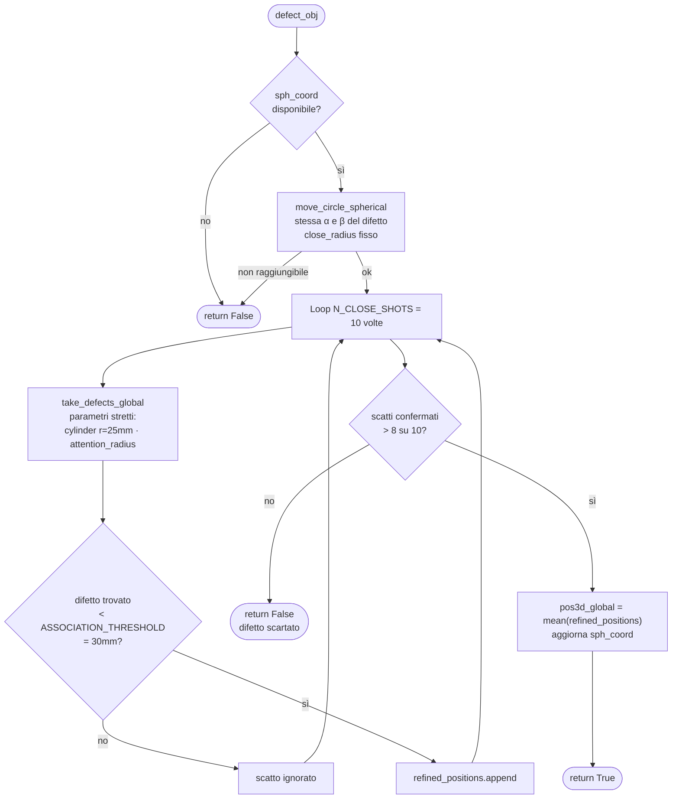
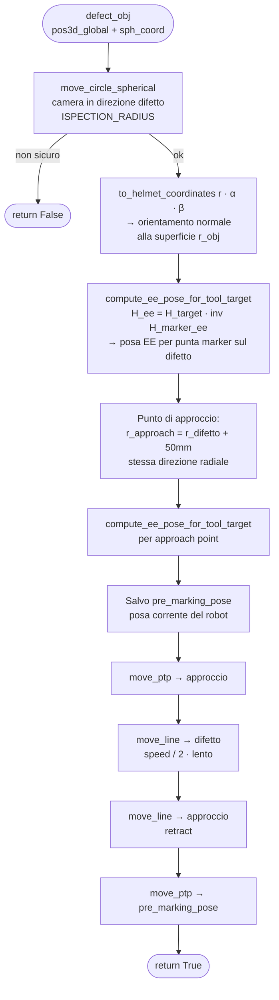

# Slide deck — Integrazione e fasi di detection
**Sezione: Cosimo De Luca** | 7 slide totali
**Moduli coperti:** `inspection_and_marking.py` · `PHASE2_inspection_marking_together.ipynb`

Usa questo file per generare un PPTX dal template fornito.
Ogni `## SLIDE N` è una slide. Sono indicati: layout, titolo, contenuto visivo, testo, note per il presentatore.

---

## SLIDE 1
**Layout:** Titolo + diagramma flusso Mermaid (occupa la parte destra/centrale)
**Titolo:** `point_and_shoot()` — ispezione in una posizione

**Testo breve sopra il diagramma:**
Muove il robot in una posizione sferica, acquisisce l'immagine ZED e restituisce la lista dei difetti in coordinate globali.

**Diagramma Mermaid:**


**Note presenter:** La posa letta dopo il movimento (`tcp_coord`) è quella reale del robot, non quella comandata — questo è importante perché l'orientamento della camera che uso per costruire la matrice omogenea deve essere quello fisico effettivo.

---

## SLIDE 2
**Layout:** Titolo + diagramma flusso Mermaid
**Titolo:** `refine_defect_position()` — affinamento con N scatti ravvicinati

**Testo breve sopra il diagramma:**
Porta la camera nella direzione del difetto a distanza ridotta, scatta N volte e media le posizioni valide per ridurre il rumore del sensore depth.

**Diagramma Mermaid:**


**Note presenter:** La soglia `> 8 su 10` è il vero filtro di qualità: se il difetto non è confermato dalla maggioranza degli scatti ravvicinati, era probabilmente un riflesso o un falso positivo sfuggito al filtraggio precedente.

---

## SLIDE 3
**Layout:** Titolo + diagramma flusso Mermaid
**Titolo:** `mark_defect()` — marcatura fisica perpendicolare al casco

**Testo breve sopra il diagramma:**
Calcola la posa esatta del braccio affinché la punta del marker tocchi il difetto perpendicolarmente, poi esegue l'avanzamento lineare.

**Diagramma Mermaid:**


**Note presenter:** La chiave è `compute_ee_pose_for_tool_target`: invece di portare la flangia del robot sul difetto, calcola dove deve stare la flangia affinché la **punta del marker** atterri esattamente sul punto. Risolve `H_ee = H_target · inv(H_marker_ee)`.

---

## SLIDE 4
**Layout:** Titolo + finestra terminale (stile dark terminal, testo monospaziato) che occupa la maggior parte della slide
**Titolo:** Acquisizione globale — il robot ispeziona il casco

**Testo breve sopra la finestra:**
Il notebook scorre 7 posizioni in sequenza. Per ogni posizione vediamo il robot muoversi, il rilevamento dei difetti e le coordinate globali.

**Contenuto della finestra terminale (testo monospaziato, sfondo scuro):**
```
=== ISPEZIONE GLOBALE ===
Numero posizioni di ispezione: 7

------------------------------------------------------------
Scatto 1/7  |  Posizione sferica: [300, 0, 90]   ← apice
  [CIRCLE] Movimento sferico: (0.0°, 90.0°) -> (0.0°, 90.0°)
  [SHORT PATH] Distanza angolare < 5°. PTP ottimizzato.
  Difetti trovati: 1
    Difetto 1 · centroid [819 289] · area 1529.0
    pos3d_camera: [ 44.3  -16.2  162.3]
    pos3d_global: [ 43.1  677.8  387.7]

------------------------------------------------------------
Scatto 4/7  |  Posizione sferica: [300, 45, 45]  ← lat. destro
  [CIRCLE] Movimento sferico: (0.0°, 25.0°) -> (45.0°, 45.0°)
  Difetti trovati: 2
    Difetto 1 · area 3349.0 · pos3d_global: [ -81.2  706.9  364.8]
    Difetto 2 · area 1088.5 · pos3d_global: [  52.0  829.0  205.1]

------------------------------------------------------------
...

=== ISPEZIONE COMPLETATA ===
Difetti totali (tutte le posizioni):     5
Difetti univoci dopo filtro duplicati:   4

  Difetto unico 1 · sph_coord [r α β]: [222.7  11.5  85.8]
  Difetto unico 2 · sph_coord [r α β]: [215.4 -22.3  77.9]
  Difetto unico 3 · sph_coord [r α β]: [179.0  56.5  20.8]
  Difetto unico 4 · sph_coord [r α β]: [203.4  35.3  70.4]
```

**Note presenter:** I log mostrano in tempo reale traiettoria, scatto, difetti e coordinate. Il notebook è pensato per essere monitorato in diretta dall'operatore.

---

## SLIDE 5
**Layout:** Titolo + grafico 3D (metà slide) + spiegazione a sinistra
**Titolo:** Filtraggio duplicati — stesse zone viste da angoli diversi

**Colonna sinistra — spiegazione:**
- 7 posizioni di ispezione → alcune zone del casco vengono viste **da più angolazioni**
- Lo stesso difetto fisico genera **più rilevamenti sovrapposti**
- `duplicate_filter()` confronta le distanze in coordinate **globali 3D**
- Se due difetti distano meno di `DUPLICATE_DISTANCE = 15 mm` → stesso difetto
- Viene tenuto quello con **area maggiore** (angolo più perpendicolare = lettura più precisa)

**Grafico 3D da inserire — descrizione per il generatore:**
Scatter 3D matplotlib con i 4 difetti unici reali:

| Label | X (mm) | Y (mm) | Z (mm) |
|---|---|---|---|
| D1 | 43.1 | 677.8 | 387.7 |
| D2 | −81.2 | 706.9 | 364.8 |
| D3 | 52.0 | 829.0 | 205.1 |
| D4 | 109.6 | 729.9 | 326.3 |

Aggiungere un quinto punto D5 vicino a D1 (es. [50.0, 681.0, 391.0]) che rappresenta il duplicato rimosso.
Intorno a ogni punto, disegnare una **sfera semitrasparente di raggio 15mm** (DUPLICATE_DISTANCE).
Le sfere di D1 e D5 si intersecano → D5 viene eliminato (area minore).
Asse Z globale verso l'alto. Punti unici in blu, duplicato in rosso/arancio, sfera del duplicato tratteggiata.

**Box risultato:**
```
Prima del filtro:  5 rilevamenti
Dopo il filtro:    4 difetti univoci
```

**Note presenter:** Il filtraggio avviene in coordinate globali, quindi funziona anche quando lo stesso difetto è stato inquadrato da posizioni molto diverse con scale e angoli completamente diversi.

---

## SLIDE 6
**Layout:** Titolo + due colonne
**Titolo:** Raffinamento — avvicinamento e media multipla

**Colonna sinistra — "Il problema":**
- L'ispezione globale scatta da **300mm di distanza**
- Il sensore depth della ZED introduce **rumore significativo** a quella distanza
- La stima `pos3d_global` dell'ispezione globale è approssimativa

**Schema visivo (centro/tra le due colonne):**
Disegnare un casco con il robot che scatta da lontano (freccia lunga, label "ispezione globale") vs da vicino con più frecce (label "raffinamento N=10").

**Colonna destra — "La soluzione":**
1. Il robot si posiziona nella **stessa direzione del difetto** ma a `CLOSE_INSPECTION_RADIUS = 300mm` dal centro casco — il difetto finisce al centro dell'inquadratura
2. `attention_radius` stretto: si cerca solo nel **centro dell'immagine**
3. `REFINE_CYLINDER_RADIUS = 25mm`: filtro cilindrico molto stretto in spazio camera
4. **10 scatti** → per ogni scatto si cerca il rilevamento più vicino alla stima precedente
5. Solo se la distanza < `ASSOCIATION_THRESHOLD = 30mm` lo scatto viene accettato
6. Se confermato in **più di 8 scatti su 10** → `pos3d_global = media` delle posizioni valide
7. Altrimenti → difetto **scartato** (era un falso positivo)

**Box risultato reale:**
```
Difetti unici in ingresso:       4
Difetti confermati e raffinati:  3   ← 1 scartato = era un falso positivo
```

**Note presenter:** La media su 10 scatti riduce il rumore del sensore ZED in modo significativo. Il difetto scartato era sopravvissuto al duplicate_filter ma non ha superato questo secondo livello: non è stato trovato ripetutamente nei close-up.

---

## SLIDE 7
**Layout:** Titolo + schema cinematica (al centro/destra) + bullet a sinistra
**Titolo:** Marcatura — cambiare sistema di riferimento per posizionare la punta

**Colonna sinistra — "Il problema geometrico":**
Il robot comanda la **flangia** (EE), non la punta del marker.
Bisogna calcolare dove portare la flangia affinché la **punta del marker** tocchi esattamente il difetto.

**Schema cinematica al centro (da disegnare come catena di frame):**
```
[CENTRO CASCO]
      │  to_helmet_coordinates(r, α, β)
      ▼
[FRAME DIFETTO]  ← posizione + orientamento normale alla superficie
      │  × inv( H_marker_ee )
      ▼
[FRAME FLANGIA EE]  ← posa da comandare al robot
```
`MARKER_POSE_EE` = offset fisso marker rispetto alla flangia (calibrato una sola volta)

**Colonna destra — "Come si ricavano le rotazioni":**
- `to_helmet_coordinates(r, α, β)` calcola l'orientamento **normale alla calotta** in quel punto sferico: l'asse Z dello strumento punta sempre verso il centro del casco
- `compute_ee_pose_for_tool_target(pos, r_obj, MARKER_POSE_EE)` risolve:
  `H_ee = H_target · inv(H_marker_ee)`
- Il **punto di approccio** si calcola nella stessa direzione radiale a `r_difetto + 50mm` — stessa orientazione, distanza maggiore
- Sequenza di movimento:
  - `move_ptp` → approccio (veloce)
  - `move_line` → difetto a **metà velocità** (tocco controllato)
  - `move_line` → approccio (retract)
  - `move_ptp` → posa pre-marking salvata

**Box dati reali:**
```
Difetti marcati:      3 / 3 confermati
Tempo medio/difetto:  ~12 secondi
Tempo totale ciclo:   ~36 secondi
```

**Note presenter:** L'orientamento perpendicolare è fondamentale: se il marker non è normale alla superficie, il segno risulta obliquo o il robot rischia di strisciare. Le rotazioni vengono dal math sferico, non da valori manuali — si adattano automaticamente a qualsiasi posizione sul casco.
