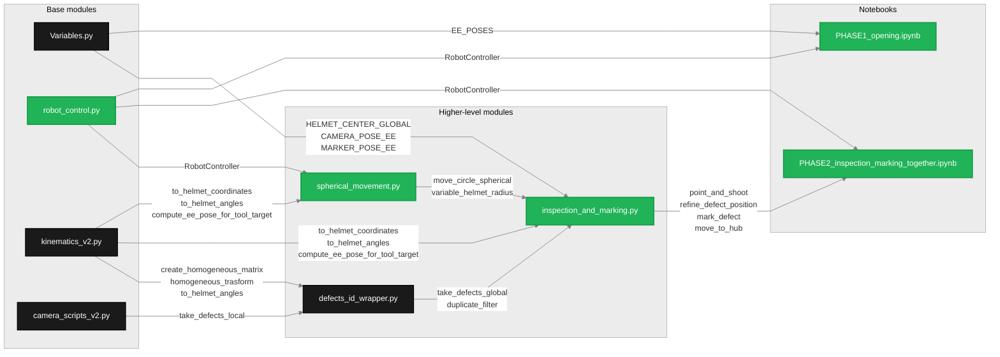
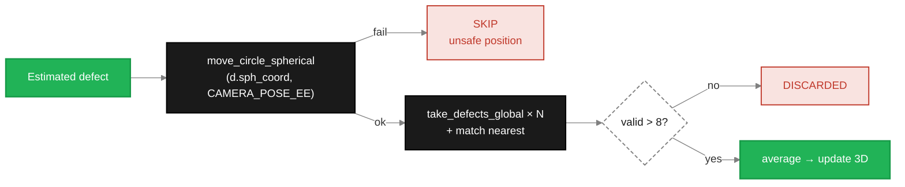
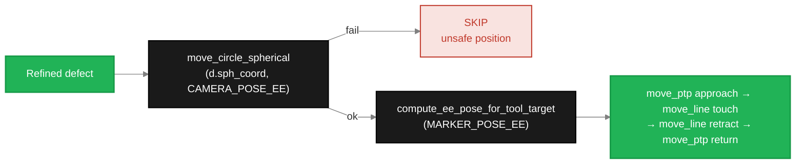

# Dependency diagram

```mermaid
%%{init: {"theme":"base","flowchart":{"htmlLabels":true,"curve":"linear"},"themeVariables":{"fontFamily":"Consolas, monospace","fontSize":"15px","lineColor":"#808080","background":"#ffffff","clusterBkg":"#ececec","clusterBorder":"#b0b0b0","edgeLabelBackground":"#ffffff"}} }%%
flowchart LR
    %% Base modules (left)
    subgraph Base["Base modules"]
        direction TB
        vars["Variables.py"]:::step
        rc["robot_control.py"]:::main
        kin["kinematics_v2.py"]:::step
        cam["camera_scripts_v2.py"]:::step
    end

    %% Higher-level modules (center)
    subgraph High["Higher-level modules"]
        direction TB
        sph["spherical_movement.py"]:::main
        defects["defects_id_wrapper.py"]:::step
        im["inspection_and_marking.py"]:::main
    end

    %% Notebooks (right)
    subgraph NB["Notebooks"]
        direction TB
        nb_together["PHASE2_inspection_marking_together.ipynb"]:::main
        nb_open["PHASE1_opening.ipynb"]:::main
    end

    rc -->|RobotController| sph
    rc -->|RobotController| nb_together
    rc -->|RobotController| nb_open

    kin -->|"create_homogeneous_matrix<br/>homogeneous_trasform<br/>to_helmet_angles"| defects
    kin -->|"to_helmet_coordinates<br/>to_helmet_angles<br/>compute_ee_pose_for_tool_target"| im
    kin -->|"to_helmet_coordinates<br/>to_helmet_angles<br/>compute_ee_pose_for_tool_target"| sph

    cam -->|take_defects_local| defects

    vars -->|"HELMET_CENTER_GLOBAL<br/>CAMERA_POSE_EE<br/>MARKER_POSE_EE"| im
    defects -->|"take_defects_global<br/>duplicate_filter"| im
    sph -->|"move_circle_spherical<br/>variable_helmet_radius"| im

    im -->|"point_and_shoot<br/>refine_defect_position<br/>mark_defect<br/>move_to_hub"| nb_together
    vars -->|EE_POSES| nb_open

    classDef step fill:#1a1a1a,stroke:#000000,stroke-width:1.5px,color:#ffffff;
    classDef dec fill:#ffffff,stroke:#808080,stroke-width:1.5px,color:#1a1a1a,stroke-dasharray:5 3;
    classDef fail fill:#f9e3e0,stroke:#c0392b,stroke-width:1.5px,color:#c0392b;
    classDef main fill:#21b357,stroke:#179a48,stroke-width:2px,color:#ffffff;
```

# Workflow — inspection_and_marking.py

```mermaid
%%{init: {"theme":"base","flowchart":{"htmlLabels":true,"curve":"linear"},"themeVariables":{"fontFamily":"Consolas, monospace","fontSize":"15px","lineColor":"#808080","background":"#ffffff","clusterBkg":"#ececec","clusterBorder":"#b0b0b0","edgeLabelBackground":"#ffffff"}} }%%
flowchart LR

    START["START<br/>INSPECTION_POSITIONS"]:::main

    %% ---------- PHASE 1: point_and_shoot ----------
    subgraph PS["PHASE 1 · point_and_shoot"]
        direction LR
        PS_MOVE["move_circle_spherical<br/>to capture position"]:::step
        PS_OK["take_defects_global<br/>(global cylindrical filter)"]:::step
        PS_DRAW["draw_multiple_debug<br/>append to all_defects"]:::step
    end

    DUP["duplicate_filter<br/>remove duplicates"]:::step

    %% ---------- PHASE 2: refine_defect_position ----------
    subgraph RF["PHASE 2 · refine_defect_position (per defect)"]
        direction LR
        RF_MOVE["move_circle_spherical<br/>(d.sph_coord, CAMERA_POSE_EE)"]:::step
        RF_SHOTS["N_CLOSE_SHOTS shots<br/>match + average positions"]:::step
        RF_COUNT{"valid > 8 /<br/>N_CLOSE_SHOTS?"}:::dec
        RF_UPD["update pos3d_global<br/>and sph_coord"]:::step
    end

    %% ---------- PHASE 3: mark_defect ----------
    subgraph MK["PHASE 3 · mark_defect (per defect)"]
        direction LR
        MK_MOVE["move_circle_spherical<br/>(d.sph_coord, CAMERA_POSE_EE)"]:::step
        MK_POSE["compute_ee_pose_for_tool_target<br/>marker + approach (MARKER_POSE_EE)"]:::step
        MK_APP["move_ptp<br/>approach point"]:::step
        MK_TOUCH["move_line<br/>touch defect"]:::step
        MK_BACK["move_line retract<br/>+ move_ptp return"]:::step
    end

    DONE["DEFECT MARKED"]:::main

    %% ---------- FAIL nodes ----------
    F_PS["SKIP<br/>unsafe position"]:::fail
    F_RF_MOVE["SKIP<br/>unsafe position"]:::fail
    F_RF_COUNT["DISCARDED<br/>confidence below threshold"]:::fail
    F_MK_MOVE["SKIP<br/>unsafe position"]:::fail

    %% ---------- main flow ----------
    START --> PS_MOVE
    PS_MOVE -->|ok| PS_OK --> PS_DRAW
    PS_MOVE -->|fail| F_PS
    PS_DRAW --> DUP --> RF_MOVE

    RF_MOVE -->|ok| RF_SHOTS
    RF_MOVE -->|fail| F_RF_MOVE
    RF_SHOTS --> RF_COUNT
    RF_COUNT -->|yes| RF_UPD
    RF_COUNT -->|no| F_RF_COUNT

    RF_UPD --> MK_MOVE
    MK_MOVE -->|ok| MK_POSE
    MK_MOVE -->|fail| F_MK_MOVE
    MK_POSE --> MK_APP --> MK_TOUCH --> MK_BACK --> DONE

    classDef step fill:#1a1a1a,stroke:#000000,stroke-width:1.5px,color:#ffffff;
    classDef dec fill:#ffffff,stroke:#808080,stroke-width:1.5px,color:#1a1a1a,stroke-dasharray:5 3;
    classDef fail fill:#f9e3e0,stroke:#c0392b,stroke-width:1.5px,color:#c0392b;
    classDef main fill:#21b357,stroke:#179a48,stroke-width:2px,color:#ffffff;
```

## Refine defect — refine_defect_position

```mermaid
%%{init: {"theme":"base","flowchart":{"htmlLabels":true,"curve":"linear"},"themeVariables":{"fontFamily":"Consolas, monospace","fontSize":"15px","lineColor":"#808080","background":"#ffffff","clusterBkg":"#ececec","clusterBorder":"#b0b0b0","edgeLabelBackground":"#ffffff"}} }%%
flowchart LR
    A["Estimated defect"]:::main --> B["move_circle_spherical<br/>(d.sph_coord, CAMERA_POSE_EE)"]:::step
    B -->|fail| FM["SKIP<br/>unsafe position"]:::fail
    B -->|ok| C["take_defects_global × N<br/>+ match nearest"]:::step
    C --> D{"valid > 8?"}:::dec
    D -->|no| FD["DISCARDED"]:::fail
    D -->|yes| E["average → update 3D"]:::main

    classDef step fill:#1a1a1a,stroke:#000000,stroke-width:1.5px,color:#ffffff;
    classDef dec fill:#ffffff,stroke:#808080,stroke-width:1.5px,color:#1a1a1a,stroke-dasharray:5 3;
    classDef fail fill:#f9e3e0,stroke:#c0392b,stroke-width:1.5px,color:#c0392b;
    classDef main fill:#21b357,stroke:#179a48,stroke-width:2px,color:#ffffff;
```

## Mark defect — mark_defect

```mermaid
%%{init: {"theme":"base","flowchart":{"htmlLabels":true,"curve":"linear"},"themeVariables":{"fontFamily":"Consolas, monospace","fontSize":"15px","lineColor":"#808080","background":"#ffffff","clusterBkg":"#ececec","clusterBorder":"#b0b0b0","edgeLabelBackground":"#ffffff"}} }%%
flowchart LR
    A["Refined defect"]:::main --> B["move_circle_spherical<br/>(d.sph_coord, CAMERA_POSE_EE)"]:::step
    B -->|fail| FM["SKIP<br/>unsafe position"]:::fail
    B -->|ok| C["compute_ee_pose_for_tool_target<br/>(MARKER_POSE_EE)"]:::step
    C --> D["move_ptp approach → move_line touch<br/>→ move_line retract → move_ptp return"]:::main

    classDef step fill:#1a1a1a,stroke:#000000,stroke-width:1.5px,color:#ffffff;
    classDef dec fill:#ffffff,stroke:#808080,stroke-width:1.5px,color:#1a1a1a,stroke-dasharray:5 3;
    classDef fail fill:#f9e3e0,stroke:#c0392b,stroke-width:1.5px,color:#c0392b;
    classDef main fill:#21b357,stroke:#179a48,stroke-width:2px,color:#ffffff;
```
