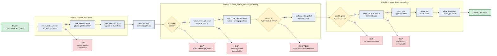

# Workflow — inspection_and_marking.py

```mermaid
%%{init: {"flowchart": {"htmlLabels": true, "curve": "linear"}, "themeVariables": {"fontSize": "14px"}} }%%
flowchart LR

    START["START<br/>INSPECTION_POSITIONS"]:::main

    %% ---------- PHASE 1: point_and_shoot ----------
    subgraph PS["PHASE 1 · point_and_shoot"]
        direction LR
        PS_MOVE["move_circle_spherical<br/>to capture position"]:::step
        PS_OK["take_defects_global<br/>(global cylindrical filter)"]:::step
        PS_DRAW["draw_multiple_debug<br/>append to all_defects"]:::step
    end

    DUP["duplicate_filter<br/>remove duplicates"]:::step

    %% ---------- PHASE 2: refine_defect_position ----------
    subgraph RF["PHASE 2 · refine_defect_position (per defect)"]
        direction LR
        RF_SPH{"sph_coord<br/>present?"}:::dec
        RF_MOVE["move_circle_spherical<br/>to close_radius"]:::step
        RF_SHOTS["N_CLOSE_SHOTS shots<br/>match + average positions"]:::step
        RF_COUNT{"valid > 8 /<br/>N_CLOSE_SHOTS?"}:::dec
        RF_UPD["update pos3d_global<br/>and sph_coord"]:::step
    end

    %% ---------- PHASE 3: mark_defect ----------
    subgraph MK["PHASE 3 · mark_defect (per defect)"]
        direction LR
        MK_POS{"pos3d_global<br/>and sph_coord?"}:::dec
        MK_MOVE["move_circle_spherical<br/>toward defect"]:::step
        MK_APP["move_ptp<br/>approach point"]:::step
        MK_TOUCH["move_line<br/>touch defect"]:::step
        MK_BACK["move_line retract<br/>+ move_ptp return"]:::step
    end

    DONE["DEFECT MARKED"]:::main

    %% ---------- FAIL nodes ----------
    F_PS["SKIP<br/>capture position<br/>unreachable"]:::fail
    F_RF_SPH["SKIP<br/>defect without sph_coord"]:::fail
    F_RF_MOVE["SKIP<br/>close-up position<br/>unreachable"]:::fail
    F_RF_COUNT["DISCARDED<br/>confidence below threshold"]:::fail
    F_MK_POS["SKIP<br/>missing coordinates"]:::fail
    F_MK_MOVE["SKIP<br/>mark position<br/>unreachable"]:::fail

    %% ---------- main flow ----------
    START --> PS_MOVE
    PS_MOVE -->|ok| PS_OK --> PS_DRAW
    PS_MOVE -->|fail| F_PS
    PS_DRAW --> DUP --> RF_SPH

    RF_SPH -->|yes| RF_MOVE
    RF_SPH -->|no| F_RF_SPH
    RF_MOVE -->|ok| RF_SHOTS
    RF_MOVE -->|fail| F_RF_MOVE
    RF_SHOTS --> RF_COUNT
    RF_COUNT -->|yes| RF_UPD
    RF_COUNT -->|no| F_RF_COUNT

    RF_UPD --> MK_POS
    MK_POS -->|yes| MK_MOVE
    MK_POS -->|no| F_MK_POS
    MK_MOVE -->|ok| MK_APP
    MK_MOVE -->|fail| F_MK_MOVE
    MK_APP --> MK_TOUCH --> MK_BACK --> DONE

    classDef step fill:#e8eef7,stroke:#2c3e50,stroke-width:1px,color:#1a1a1a,rx:0,ry:0;
    classDef dec fill:#fff3cd,stroke:#b8860b,stroke-width:1px,color:#1a1a1a,rx:0,ry:0;
    classDef fail fill:#f8d7da,stroke:#a94442,stroke-width:1px,color:#1a1a1a,rx:0,ry:0;
    classDef main fill:#d4edda,stroke:#1e7e34,stroke-width:2px,color:#1a1a1a,rx:0,ry:0;
```
